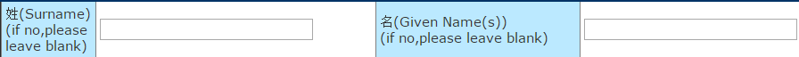
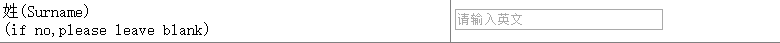
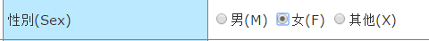
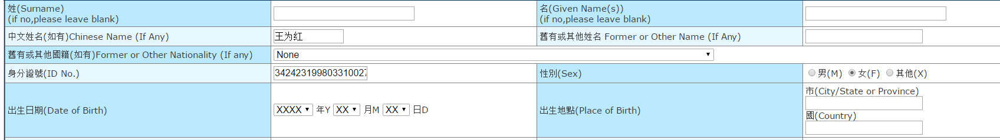
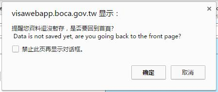

#### 我修改的表单是一个[线上填写中国签证系统](https://visawebapp.boca.gov.tw/BOCA_MRVWeb/subroot/MRV00FORM.action;jsessionid=624FC6B1339BEAF0926BFD7D81DDCE4B)的网页
实在是不知道应该修改些什么，对各种属性还没有特别好的掌握，就只能提出这几个了orz

比如
***
*  

  * 填写姓名时一定要填英文才可以。

    * 于是修改了一下源代码：增加了`placeholder`这个属性
        ```
        <TR>
          <TD class=title5 width=25%>姓(Surname)<br>(if no,please leave blank)</TD>
          <TD class=title4 width=25%>
              <input type="text" name="mrvApplicationTemp.surname" size="25" maxlength="45" value="" placeholder="请输入英文" id="mrvApplicationTemp.surname" class="text16" onkeyup="value=value.replace(/[^\s|a-z|A-Z]/g,'')"/>
            </TD>
          <TD class=title5 width=25%>名(Given Name(s))<br>(if no,please leave blank)</TD>
          <TD class=title4 width=25%>
              <input type="text" name="mrvApplicationTemp.giveName" size="25" maxlength="45" value="" placeholder="请输入英文" id="mrvApplicationTemp.giveName" class="text16" onkeyup="value=value.replace(/[^\s|a-z|A-Z]/g,'')"/>
            </TD>
        </TR>
        ```
  * 不过这个有一点好的地方是它如果输入的东西与设定的东西不同会直接把输错的东西删除。

  * 
***

* 

  * 这个其他选项究竟是什么意思？？？

    * 直接删掉了
        ```
        <TR>
          <TD class=title5>性別(Sex)</TD>
          <TD class=title4>
            <input type="radio" name="mrvApplicationTemp.sex" id="mrvApplicationTemp.sexM" value="M"/><label for="mrvApplicationTemp.sexM">男(M)</label>
            <input type="radio" name="mrvApplicationTemp.sex" id="mrvApplicationTemp.sexF" value="F"/><label for="mrvApplicationTemp.sexF">女(F)</label>
          </TD>
        </TR>
        ```
***        
* 

  * 所有的信息都要提交以后才会告诉你哪里没有填写

  * 我觉得可以通过在方框后面加一个红点点或者在方框后面写上（must to be filled）会比较好一点

***
* 

  * 个人认为这个做得很好
